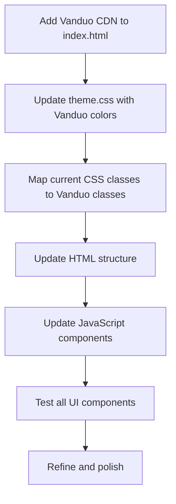

# Vanduo Framework Integration Plan for Chess Project

## Overview

This document outlines the plan to integrate the **Vanduo Framework v1.1.6** into the browser-chess-pure-js project. Vanduo is a lightweight, pure HTML/CSS/JS framework with no dependencies, featuring:
- 12-column responsive grid system
- Component library (buttons, forms, cards, modals, etc.)
- Theme customizer with dark mode
- Typography and color system
- Phosphor Icons integration

> **Status:** ✅ Upgraded to v1.1.6 on 2026-02-20. See `plans/vanduo-v1.1.6-upgrade-plan.md` for migration details.

## Current Project Analysis

### Existing Structure
```
browser-chess-pure-js/
├── index.html           # Main HTML with custom classes
├── styles/
│   ├── layout.css       # Custom layout (450 lines)
│   └── theme.css        # Custom theme with CSS variables (120 lines)
└── js/ui/
    ├── BoardView.js     # Chess board rendering
    ├── Controls.js      # Game controls
    ├── GameEndModal.js  # Game end modal
    └── ThemeManager.js  # Theme switching logic
```

### Current CSS Classes Used
- Layout: `.app-header`, `.app-main`, `.board-section`, `.side-panel`, `.btn-group`
- Buttons: `.btn`, `.btn-sm`, `.btn-primary`
- Forms: `select`, `input[type="number"]`
- Modal: `.game-end-modal`, `.game-end-modal-backdrop`, `.game-end-modal-content`
- Chess board: `.chess-square`, `.chess-piece`, `.light`, `.dark`

### CSS Variables Currently Used
```css
--color-bg, --color-bg-elevated, --color-text, --color-subtle-text
--color-accent, --color-border
--board-light, --board-dark, --board-highlight, --board-legal-move
--font-family-sans, --radius-lg, --transition-fast
--shadow-soft, --btn-bg, --btn-text
```

## Integration Plan

### Phase 1: Add Vanduo Framework to Project

#### Step 1.1: Update index.html
Add Vanduo CDN links to the `<head>`:

```html
<!-- Vanduo Framework CSS -->
<link rel="stylesheet" href="https://cdn.jsdelivr.net/gh/Nostromo-618/vanduo-framework@v1.0.0/dist/vanduo.min.css">

<!-- Phosphor Icons -->
<link rel="stylesheet" href="https://cdn.jsdelivr.net/gh/Nostromo-618/vanduo-framework@v1.0.0/css/icons/icons.css">

<!-- Custom theme.css (after Vanduo for overrides) -->
<link rel="stylesheet" href="styles/theme.css">
<link rel="stylesheet" href="styles/layout.css">

<!-- Vanduo Framework JS -->
<script src="https://cdn.jsdelivr.net/gh/Nostromo-618/vanduo-framework@v1.0.0/dist/vanduo.min.js"></script>
```

#### Step 1.2: Create Vanduo-compatible theme variables
Update `styles/theme.css` to use Vanduo's color system:

```css
:root {
  /* Map to Vanduo color variables */
  --color-primary: var(--primary-5);      /* Cyan brand color */
  --color-primary-dark: var(--primary-7);
  --color-primary-light: var(--primary-3);
  --color-bg: var(--gray-0);
  --color-bg-elevated: var(--gray-0);
  --color-text: var(--gray-9);
  --color-subtle-text: var(--gray-6);
  --color-border: var(--gray-3);
  
  /* Chess-specific colors */
  --board-light: #f0d9b5;
  --board-dark: #b58863;
  --board-highlight: #fbbf24;
  --board-legal-move: rgba(16, 185, 129, 0.4);
  
  /* Font override if needed */
  --font-family-base: system-ui, -apple-system, sans-serif;
}
```

### Phase 2: Map Current Components to Vanduo Classes

#### 2.1 Buttons
| Current Class | Vanduo Class | Notes |
|--------------|--------------|-------|
| `.btn` | `.btn` | Base button class |
| `.btn-sm` | `.btn-sm` | Small button variant |
| `.btn-primary` | `.btn btn-primary` | Primary action button |
| `.btn-group` | `.btn-group` | Button group wrapper |

**Update index.html:**
```html
<!-- Before -->
<button class="btn btn-sm active">White</button>

<!-- After -->
<button class="btn btn-sm is-active">White</button>
```

#### 2.2 Form Elements
| Current Element | Vanduo Class | Notes |
|----------------|--------------|-------|
| `select` | `.input` or `.custom-select-input` | Use `.input` for basic selects |
| `input[type="number"]` | `.input` | Form input class |
| Label + select | `.form-group` with `.form-label` | Better structure |

**Update Controls.js and index.html:**
```html
<div class="form-group">
  <label for="difficulty-select" class="form-label">Computer strength:</label>
  <select id="difficulty-select" class="input">
    <option value="1">Level 1 - Very Easy</option>
    <!-- ... -->
  </select>
</div>
```

#### 2.3 Card Layout for Side Panel
| Current | Vanduo | Notes |
|---------|--------|-------|
| `.side-panel` | `.card card-outlined` | Use outlined card variant |
| Sections | `.card-header`, `.card-body`, `.card-footer` | Card component structure |

**Update index.html:**
```html
<aside class="card card-outlined side-panel" aria-label="Game controls and status">
  <section class="card-body controls-section">
    <!-- Controls content -->
  </section>
</aside>
```

#### 2.4 Modal for Game End
| Current Class | Vanduo Class | Notes |
|--------------|--------------|-------|
| `.game-end-modal` | `.modal` | Base modal component |
| `.game-end-modal-backdrop` | `.modal-backdrop` | Modal backdrop |
| `.game-end-modal-content` | `.modal-content` | Modal content wrapper |
| Close button | `.modal-close` with `data-dismiss="modal"` | Vanduo modal close |

**Update GameEndModal.js:**
```javascript
// Replace current modal HTML structure with Vanduo modal structure
const modalHTML = `
<div class="modal" id="game-end-modal">
  <div class="modal-backdrop"></div>
  <div class="modal-dialog">
    <div class="modal-content">
      <div class="modal-header">
        <h3 class="modal-title">Game Over</h3>
        <button type="button" class="modal-close" data-dismiss="modal" aria-label="Close">
          <span aria-hidden="true">&times;</span>
        </button>
      </div>
      <div class="modal-body">
        <!-- Game end content -->
      </div>
      <div class="modal-footer">
        <button type="button" class="btn btn-secondary" data-dismiss="modal">Close</button>
      </div>
    </div>
  </div>
</div>
`;
```

### Phase 3: Grid System Integration

#### 3.1 Main Layout
Current uses custom grid. Update to Vanduo's grid system:

```html
<!-- Before -->
<div class="app-main">
  <section class="board-section">...</section>
  <aside class="side-panel">...</aside>
</div>

<!-- After -->
<div class="app-main container-lg">
  <div class="row">
    <div class="col-12 col-lg-8 board-section">
      <!-- Board -->
    </div>
    <div class="col-12 col-lg-4">
      <!-- Side panel in card -->
    </div>
  </div>
</div>
```

#### 3.2 Responsive Breakpoints
- Base: Mobile first
- `sm`: 576px
- `md`: 768px
- `lg`: 992px (where side panel moves below board)
- `xl`: 1200px
- `2xl`: 1400px

### Phase 4: Theme Customization

#### 4.1 Keep Chess Board Colors Constant
The chess board colors should NOT change with theme. Vanduo's theme affects global colors, so we'll keep board colors as custom CSS variables that don't get overridden.

#### 4.2 Add Theme Toggle
Use Vanduo's built-in theme switcher:

```html
<select data-toggle="theme">
  <option value="system">System</option>
  <option value="light">Light</option>
  <option value="dark">Dark</option>
</select>
```

Or use the customizer trigger:

```html
<button class="theme-customizer-trigger" data-theme-customizer-trigger aria-label="Open theme customizer">
  <i class="ph ph-paint-roller"></i>
</button>
```

### Phase 5: Icons Integration

#### 5.1 Add Phosphor Icons
Use Vanduo's bundled Phosphor icons for better visual appeal:

```html
<!-- Before (no icons) -->
<button id="new-game-btn" class="btn btn-primary">New Game</button>

<!-- After (with icon) -->
<button id="new-game-btn" class="btn btn-primary">
  <i class="ph ph-play mr-2"></i> New Game
</button>
```

#### 5.2 Suggested Icons for Chess UI
- New Game: `ph-play``
- Settings or `ph-plus: `ph-gear`
- Close: `ph-x`
- Info: `ph-info`

### Phase 6: Component-by-Component Migration

#### 6.1 Header
```html
<!-- Current -->
<header class="app-header">
  <h1 class="app-title">Kilo Polaris Chess</h1>
  <div class="theme-toggle">
    <label for="theme-select">Theme:</label>
    <select id="theme-select">...</select>
  </div>
</header>

<!-- Vanduo version -->
<header class="navbar navbar-fixed">
  <div class="navbar-container">
    <div class="navbar-brand">
      <a href="#"><i class="ph-fill ph-chess-piece" style="color: var(--color-primary);"></i> Kilo Polaris Chess</a>
    </div>
    <div class="navbar-menu">
      <select data-toggle="theme" class="input" style="width: auto;">
        <option value="system">System</option>
        <option value="light">Light</option>
        <option value="dark">Dark</option>
      </select>
    </div>
  </div>
</header>
```

#### 6.2 Move History (List Component)
```html
<!-- Current -->
<ol id="move-history" class="move-history-list"></ol>

<!-- Vanduo version -->
<ul class="collection" id="move-history">
  <!-- Each move as collection-item -->
  <li class="collection-item">
    <div class="collection-content">
      <div class="collection-title">1. e4 e5</div>
    </div>
  </li>
</ul>
```

#### 6.3 Status Indicators
Use Vanduo's badge or chip components:

```html
<span class="badge badge-primary">Your Turn</span>
<span class="badge badge-success">Checkmate!</span>
<span class="badge badge-warning">Check</span>
```

### Phase 7: Utility Classes to Keep

Some custom CSS in `layout.css` should be preserved:

1. **Chess board specific:**
   - `.chess-square` - Board square styling
   - `.chess-piece` - Piece glyphs
   - `.highlight-selected`, `.highlight-legal`, `.highlight-last-move` - Move indicators

2. **Custom animations:**
   - Modal icon pop animation

3. **Board-responsive sizing:**
   - `#board-container` responsive sizing

## Implementation Steps

### Step 1: Add Vanduo CDN
Update `index.html` head section with Vanduo CSS and JS.

### Step 2: Create Vanduo-compatible CSS
Update `styles/theme.css` to use Vanduo's color palette and variables.

### Step 3: Update HTML Structure
Replace current HTML structure with Vanduo component classes.

### Step 4: Update JavaScript
Modify UI components to work with Vanduo's modal and form patterns.

### Step 5: Test and Refine
Verify all components work correctly and look consistent.

## Files to Modify

1. **`index.html`** - Add Vanduo CDN, update component classes
2. **`styles/theme.css`** - Map to Vanduo color variables
3. **`styles/layout.css`** - Keep chess-specific styles, remove redundant ones
4. **`js/ui/Controls.js`** - Update form structure
5. **`js/ui/GameEndModal.js`** - Update modal structure
6. **`js/ui/ThemeManager.js`** - May need updates for Vanduo theme system

## Mermaid Diagram: Integration Workflow



## Benefits of Integration

1. **Consistency** - Unified styling system across the project
2. **Responsiveness** - Better mobile support via grid system
3. **Maintainability** - Well-documented framework with clear patterns
4. **Accessibility** - WCAG 2.1 AA compliant components
5. **Theme Support** - Built-in dark mode and customization
6. **Icons** - 1500+ Phosphor icons for visual enhancements
7. **Lightweight** - No build tools or dependencies required

## Risk Mitigation

1. **Chess Board Colors** - Keep board colors as custom variables not affected by Vanduo themes
2. **Custom Animations** - Preserve existing modal animations
3. **JavaScript Logic** - UI components work independently of framework styling
4. **Progressive Enhancement** - Fall back gracefully if CDN unavailable

---

**Plan Created:** 2026-01-31
**Framework Version:** Vanduo v1.1.6 (upgraded 2026-02-20)
**Status:** ✅ Implemented and Upgraded to v1.1.6
